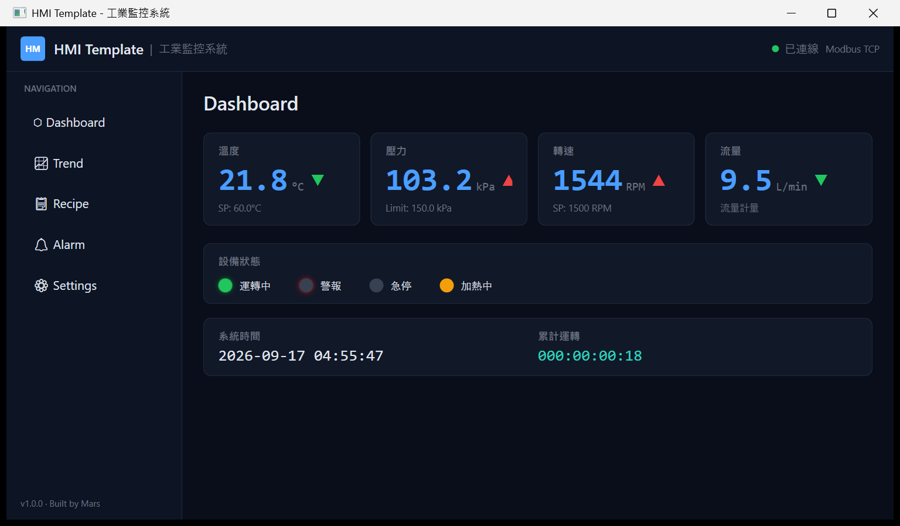
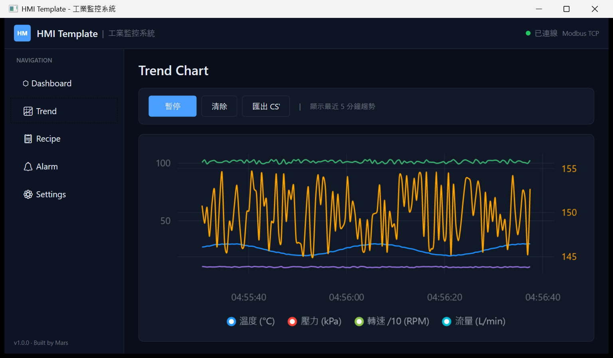
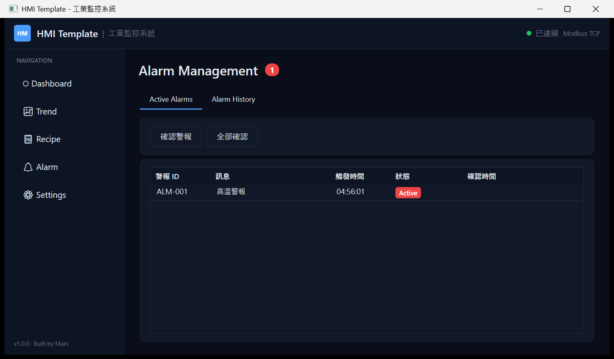
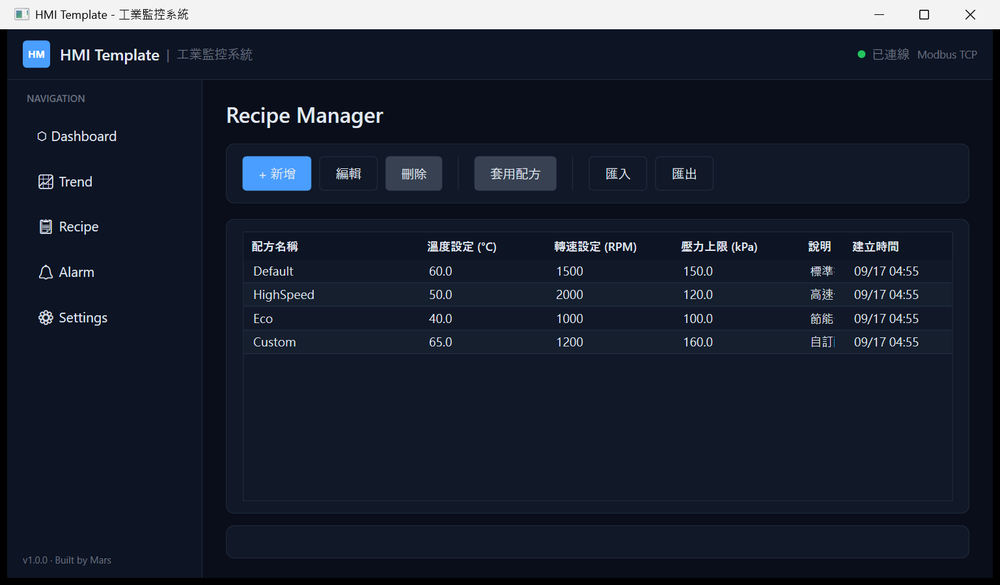

# HMI Template — Industrial Modbus TCP Monitor

> **工業 HMI 範本，內建 Modbus TCP Slave 模擬器，雙擊 .exe 即可看到即時製程畫面。**
>
> An industrial HMI template with a built-in Modbus TCP slave simulator — no PLC or external tools needed.

---

## Screenshots

| Dashboard | Trend |
|---|---|
|  |  |
| 即時數值卡片、趨勢箭頭、設備狀態 LED | LiveCharts 最近 5 分鐘趨勢，轉速走右 Y 軸 |

| Alarm | Recipe |
|---|---|
|  |  |
| Active → Acknowledged → Cleared 狀態流（截圖時把 `config.json` 的高溫閾值降到 27.0°C，讓模擬器的 25 ± 5°C 正弦波真的觸發） | 配方 CRUD，套用後寫入 HR4 / HR5 / HR6 |

---

## Quick Start

```bash
git clone https://github.com/Lumeon-Labs/hmi-modbus-template.git
cd hmi-modbus-template
dotnet restore
dotnet run --project src/HmiTemplate.UI
```

啟動後會自動：

```
1. 啟動內建 Modbus TCP Slave（Port 502）
2. 開始數據模擬 + 連線
3. 顯示即時波形、警報、配方管理
```

**不需要 PLC、不需要任何額外設定 —— 只需要 .NET 8 SDK。**

---

## Features

- **即時監控 Dashboard**：溫度、壓力、轉速、流量卡片，趨勢箭頭，LED 指示燈
- **5 分鐘趨勢圖**：LiveCharts 即時折線圖，支援暫停/繼續/匯出 CSV
- **配方管理**：新增/編輯/刪除/套用配方，寫入 Modbus HR4/HR5/HR6
- **警報系統**：Hysteresis 防抖設計，Active / Acknowledged / Cleared 狀態流
- **設定頁面**：連線參數調整，Slave 模擬器 Start/Stop
- **內建 Modbus TCP Slave**：完全自給自足，不需外部設備
- **深色工業風 UI**：Consolas 大字數值，LED 發光效果，動畫閃爍警報

---

## Modbus Register Mapping

| Register | Address | Description | Scaling |
|----------|---------|-------------|---------|
| HR0 | 0 | 溫度 (°C) | ÷ 10 |
| HR1 | 1 | 壓力 (kPa) | ÷ 10 |
| HR2 | 2 | 轉速 (RPM) | Direct |
| HR3 | 3 | 流量 (L/min) | ÷ 10 |
| HR4 | 4 | 溫度設定值 | Write |
| HR5 | 5 | 轉速設定值 | Write |
| HR6 | 6 | 壓力上限 | Write |
| Coil0 | 0 | 運轉中 | |
| Coil1 | 1 | 警報 | |
| Coil2 | 2 | 急停 | |
| Coil3 | 3 | 加熱中 | |

---

## Tech Stack

- **.NET 8 / WPF**
- **NModbus 3** — Modbus TCP Master + Slave
- **CommunityToolkit.Mvvm 8** — MVVM, `[ObservableProperty]`, `[RelayCommand]`
- **LiveChartsCore.SkiaSharpView.WPF** — 即時趨勢圖
- **Serilog** — 結構化日誌，每日滾動檔案
- **Microsoft.Extensions.DependencyInjection** — DI 容器
- **xUnit + FluentAssertions** — 單元測試

---

## Build from Source

```bash
git clone https://github.com/Lumeon-Labs/hmi-modbus-template.git
cd hmi-modbus-template
dotnet restore
dotnet build -c Release
```

**Run tests:**
```bash
dotnet test
```
目前共 5 個 xUnit 測試，全數通過。

**Publish single .exe:**
```bash
dotnet publish src/HmiTemplate.UI/HmiTemplate.UI.csproj \
  -c Release -r win-x64 --self-contained \
  -p:PublishSingleFile=true -o publish/
```

---

## Customization Ideas

Fork 這個專案後你可以：

- **連到真實 PLC**：Settings 頁面改 IP，停用 DataSimulatorService
- **新增製程變數**：擴展 HR7~HR15，更新 `ProcessData` 和 Dashboard 卡片
- **自訂警報規則**：編輯 `config.json` 的 `alarmRules` 陣列
- **換色主題**：修改 `Resources/Styles.xaml` 的色彩定義
- **加 OPC UA**：在 Core 層新增 OpcUaService，UI 層插入 DI 即可
- **多語言**：新增 `Resources/Strings.resx`
- **歷史趨勢查詢**：把 TrendBuffer 接到 SQLite / InfluxDB

---

## 要改成你的設備？

Fork 回去自己改完全沒問題（MIT）。想省時間的話，我接付費客製：

- 換成你的 PLC 或儀表（Modbus TCP／RTU、三菱 MC Protocol）、加製程變數、改畫面、接資料庫或 Excel 報表
- 時計 NT$2,500／小時（2 小時起、遠端），或專案報價

聯絡：<https://mars-industrial.pages.dev/#contact> ・ LINE 官方帳號 [@935pczdn](https://line.me/R/ti/p/@935pczdn)

---

## 作者

**Built by Mars**

---

## License

MIT License — 自由使用、修改、商業化，保留版權聲明即可。

---

## Questions

Open an issue at
[github.com/Lumeon-Labs/hmi-modbus-template/issues](https://github.com/Lumeon-Labs/hmi-modbus-template/issues).
